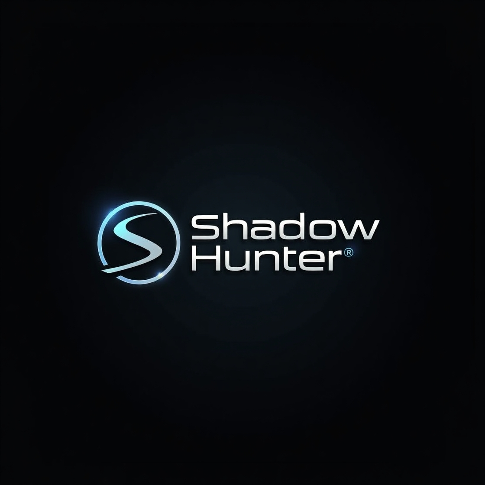

<h1 align="center">Toolkit for Retrieval and Analysis of Cyber Evidence (Shadow Hunter)</h1>

<p align="center">
  Shadow Hunter is a digital forensic tool I developed as my final year project. It provides an intuitive interface for analyzing disk images and includes a range of functionalities to assist forensic examiners in extracting and viewing the contents of various image file formats.
</p>

<p align="center">
  
</p>

## Navigation 🧭

- [Preview 👀](#preview-)
- [Features 🌟](#features-)
- [Screenshots 📸](#screenshots-)
- [Supported Image Formats 💾](#supported-image-formats-)
- [Tested File Systems 🗂️](#tested-file-systems-%EF%B8%8F)
- [Cross-Platform Compatibility 🖥️💻](#cross-platform-compatibility-%EF%B8%8F)
- [Getting Started 🚀](#getting-started-)
  - [Prerequisites 🛠️](#prerequisites-)
  - [Configuration ⚙️](#configuration-%EF%B8%8F)
  - [Running the Tool ▶️](#running-the-tool-%EF%B8%8F)
- [Built With 🧱](#built-with-)
- [Work in Progress 🛠️](#work-in-progress-)
- [Testing & Feedback 🧪](#testing--feedback-)
- [Contributing 🤝](#contributing-)
- [Socials 👨‍💻](#socials-)

## Contributors 👥

Special thanks to our contributors who helped improve **Shadow Hunter**:

- **[@ntwali123](https://github.com/ntwali123)** : *FrontEnd Dev*
- **[@asimwe1](https://github.com/asimwe1)** : *Python Dev*
- **[@kai-lucky72](https://github.com/kai-lucky72)** : *CyberSecurity*

## Preview 👀      [⬆️]\(#toolkit-for-retrieval-and-analysis-of-cyber-evidence-Shadow Hunter )



## Features 🌟      [⬆️]\(#toolkit-for-retrieval-and-analysis-of-cyber-evidence-Shadow Hunter )

✅ \***Image Mounting**: Mount forensic disk images. (Windows only) \
✅ **Tree Viewer**: Navigate through the disk image structure, including partitions and files.\
✅ **Detailed File Analysis**: View file content in different formats, such as HEX, text, and application-specific views.\
✅ **EXIF Data Extraction**: Extract and display EXIF metadata from photos.\
✅ **Registry Viewer**: View and examine Windows registry files.\
✅ **Basic File Carving**: Recover deleted files from disk images.\
✅ **Virus Total API Integration**: Check files for malware using the Virus Total API.\
✅ **E01 Image Verification**: Verify the integrity of E01 disk images.\
✅ **Convert E01 to Raw**: Convert E01 disk images to raw format.\
✅ **Message Decoding**: Decode messages from base64, binary, and other encodings.

---

## 📸 Screenshots  
| Registry Browser 🗂️ | File Carving 🔪 | File Search 🔍 | Image Verification ✅ |
|----------------------|---------------|---------------|-----------------------|
|  |  |  |  |

---

## 💾 Supported Image Formats  
| Format | Extensions | Split | Unsplit |
|--------|------------|--------|--------|
| EnCase® | `*.E01`, `*.Ex01` | ✔️ | ✔️ |
| SMART | `*.s01` | ✔️ | ✔️ |
| Unix/Linux DD | `*.dd`, `*.img`, `*.raw` | ✔️ | ✔️ |
| ISO | `*.iso` | ❌ | ✔️ |
| AccessData | `*.ad1` | ✔️ | ✔️ |

---

## 🗂️ Tested File Systems  
✅ NTFS  
✅ FAT32  
✅ exFAT  
❌ HFS+, APFS, EXT2/3/4 (Testing Needed)  

---

## 💻 Cross-Platform Compatibility  
| OS | Supported |
|----|------------|
| macOS Sonoma 🍏 | ✔️ |
| Kali Linux 🐧 | ✔️ |
| WSL2 - Ubuntu 22.04 🐧 | ✔️ |
| Windows 10 🏁 | ✔️ |

---

## 🚀 Getting Started  
### 🔧 Prerequisites  
#### **Windows Users**  
> ⚠️ Python **3.12 is NOT supported**. Install Python **3.11** [here](https://www.python.org/downloads/release/python-3110/).

If you see **"Microsoft Visual C++ 14.0 or greater is required"**, install [C++ Build Tools](https://visualstudio.microsoft.com/visual-cpp-build-tools/).  
```bash
pip install -r requirements.txt
```
<p>It is better if ran in python virtual environment</p>

#### **macOS - Apple Silicon**  
```bash
python3.11 -m venv venv
source venv/bin/activate
chmod +x install_macos_silicon.sh
./install_macos_silicon.sh
```
#### **Ubuntu on WSL**  
```bash
chmod +x WSL_Ubuntu_install.sh
./WSL_Ubuntu_install.sh
```

### ⚙️ Configuration  
> Go to **Options → API Keys** to configure **VirusTotal** and **Veriphone APIs**.

### ▶️ Running the Tool  
```bash
python main.py
```

---

## 🏗️ Built With  
- **[pytsk3](https://pypi.org/project/pytsk3/)** - SleuthKit bindings  
- **[libewf-python](https://github.com/libyal/libewf)** - EWF format support  
- **[PySide6](https://pypi.org/project/PySide6/)** - GUI  
- **[Arsenal Image Mounter](https://arsenalrecon.com/products/image-mounter/)** - Disk image mounting (Windows only)  

---

## 🛠️ Work in Progress  
🚧 **Direct Video/Audio Playback**  
🚧 **File Search & Viewer Integration**  
🚧 **Cross-Platform Image Mounting**  
🚧 **File Carving Enhancements**  
🚧 **Dark Mode UI Fixes**  

---

## 🧪 Testing & Feedback  
- **Tested:** `dd`, `E01`  
- **Needs More Testing:** `Ex01`, `Lx01`, `s01`, `ad1`  
- **Seeking Sample Images!** (If you have disk images for testing, please contribute!)  

---

## 🤝 Contributing  
✅ **Report Issues**: Open an issue [here](https://github.com/ntwali123/teamtracer-Forensic-Toolkit/issues).  
✅ **Submit PRs**: Fork the repo [here](https://github.com/ntwali123/teamtracer-Forensic-Toolkit/fork).  
✅ **Testing Contributions**: Send sample disk images to `landryasimwe@gmail.com`.  

---

## 🔗 Socials  
  
  

